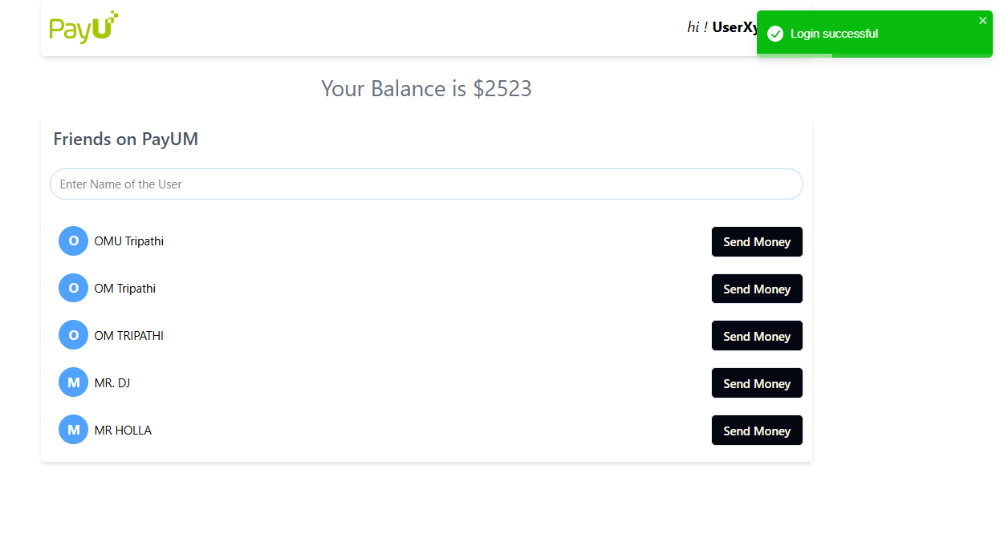
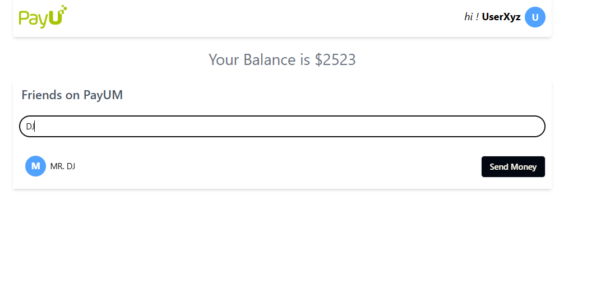

# PayUM – Peer-to-Peer Payment Platform

PayUM is a modern, full-stack Paytm-inspired application that enables users to seamlessly send and receive money with friends, all in a secure and intuitive environment. Built with a robust Node.js/Express backend and a lightning-fast React + Vite frontend, PayUM delivers a real-world digital wallet experience for learning, demo, and portfolio use.

---

## 🚀 Features

- **User Authentication**: Secure signup, login, and session management using JWT and HTTP-only cookies.
- **Account Management**: Each user has a unique account with a randomly initialized balance.
- **Send Money Instantly**: Transfer funds to friends with a single click, with real-time balance updates and transaction validation.
- **User Search & Filtering**: Find friends by name or email with instant search and filter capabilities.
- **Responsive UI**: Clean, mobile-friendly interface built with React, Tailwind CSS, and Vite.
- **Robust Error Handling**: User-friendly toasts and error messages for all actions.
- **Secure Backend**: Input validation with Zod, password hashing with bcrypt, and secure database transactions with Mongoose.

---

## 🏗️ Tech Stack

- **Frontend**: React, Vite, Tailwind CSS, Axios, React Router, React Toastify
- **Backend**: Node.js, Express, MongoDB (Mongoose), Zod, JWT, bcrypt
- **Dev Tools**: Nodemon, ESLint, Prettier

---

## 📦 Project Structure

```
├── backend
│   ├── index.js           # Express server entry
│   ├── db.js              # MongoDB connection & models
│   ├── config.js          # JWT secret & config
│   ├── types.js           # Zod validation schemas
│   ├── routes/
│   │   ├── apiRouter.js   # Main API router
│   │   ├── userRouter.js  # User-related endpoints
│   │   └── account.js     # Account & transfer endpoints
│   └── middlewares/
│       └── auth.js        # JWT authentication middleware
├── frontend
│   ├── src/
│   │   ├── components/    # React components (Dashboard, SendMoney, Signin, SignUp)
│   │   ├── assets/        # Static assets
│   │   ├── App.jsx        # Main app
│   │   └── ...
│   ├── public/            # Static files
│   └── vite.config.js     # Vite config
├── Dockerfile             # (Optional) Containerization
└── README.md
```

---

## ⚙️ Getting Started

### Prerequisites
- Node.js (v18+ recommended)
- MongoDB (local or Atlas)

### 1. Clone the Repository
```sh
git clone https://github.com/omtripathii/paytm-clone.git
cd paytm-clone
```

### 2. Backend Setup
```sh
cd backend
npm install
# Configure MongoDB URI and JWT_SECRET in config.js
node index.js
```

### 3. Frontend Setup
```sh
cd ../frontend
npm install
npm run dev
```

### 4. Open in Your Browser
Visit [http://localhost:5173](http://localhost:5173)

---

## 🛡️ Security & Validation
- All sensitive routes are protected with JWT authentication.
- Input validation is enforced on both frontend and backend.
- Passwords are hashed before storage.
- Transactions are atomic and validated for sufficient balance.

---


## ✨ Screenshots

<div align="center">
	
	<br />
	<b>Dashboard</b>
	<br /><br />
	
	<br />
	<b>Send Money Modal</b>
	<br /><br />
	
	<br />
	<b>Transaction Success</b>
	<br /><br />
	
	<br />
	<b>User Filter</b>
	<br /><br />
	
	
	<br />
	<b>Sign In / Sign Up</b>
</div>

---

## 🤝 Contributing
Pull requests are welcome! For major changes, please open an issue first to discuss what you would like to change.

---

## 📄 License
This project is for educational/demo purposes only and is not intended for production use.

---

## 🙏 Acknowledgements
- Inspired by Paytm and modern fintech UIs
- Built with love using open-source tools
